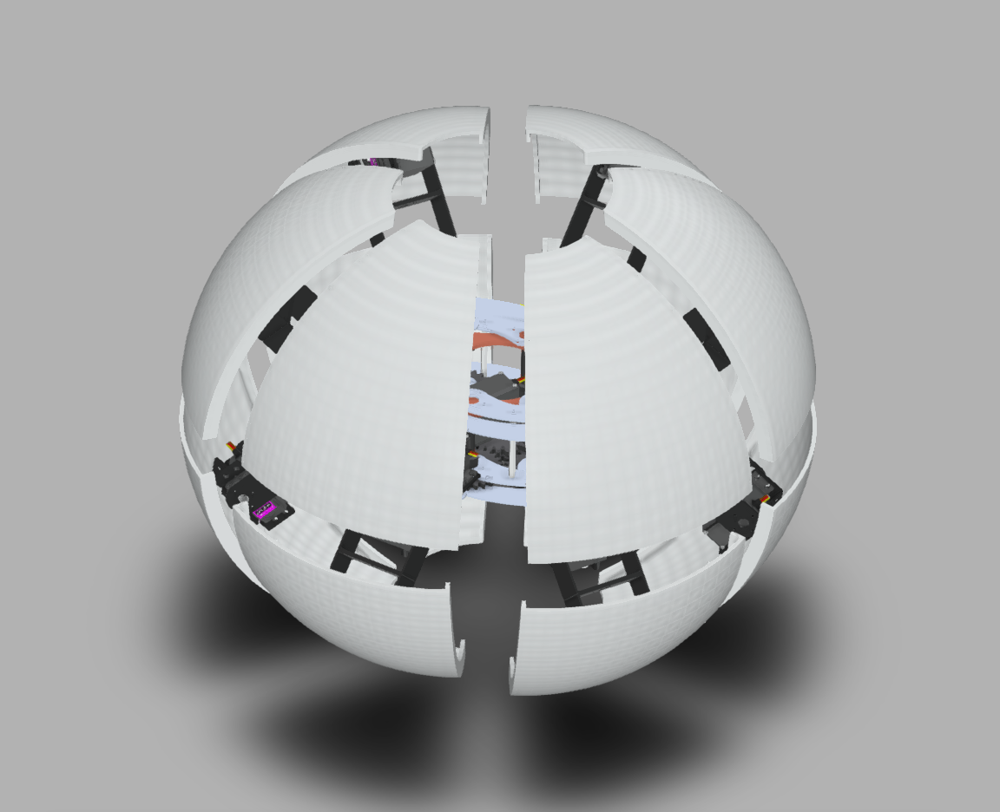
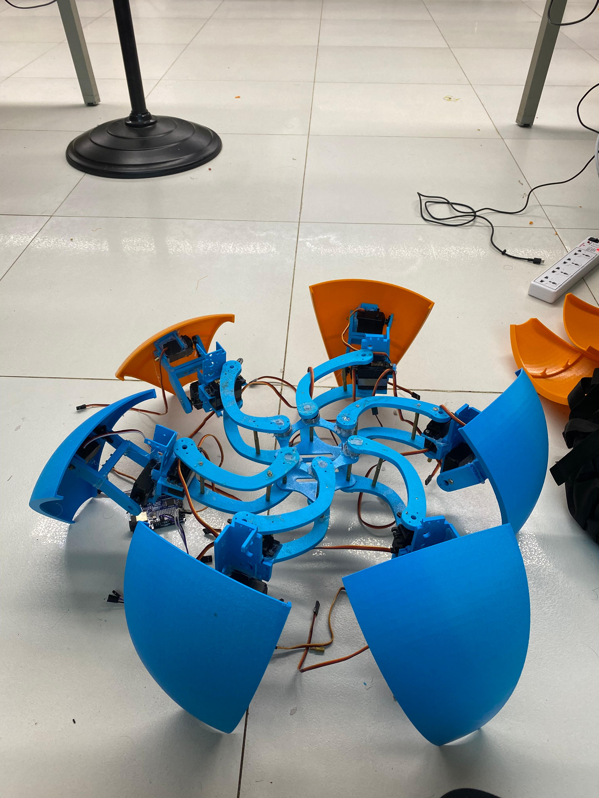
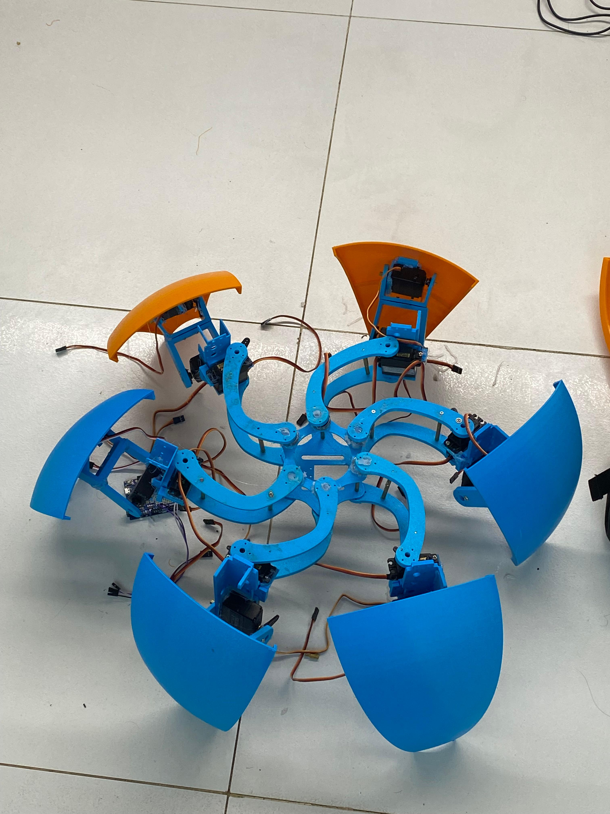

# Morphex
Multi-Modal Hexapod Robot capable of transforming seamlessly between a stable, sixlegged walking configuration and a highly mobile, rolling spherical form.

Introduction
Morphex is a fascinating project that explores the concept of multi-modal locomotion in robotics. It is a Multi-Modal Hexapod Robot capable of transforming seamlessly between two distinct forms:

A stable, six-legged walking configuration (Hexapod mode) for navigating complex terrain.

A highly mobile, rolling spherical form (Ball/Spherical mode) for efficient movement across flat surfaces and rapid transit.

This project focuses on the mechanics and control systems required for this unique transformation and motion.

PROGRESS 

